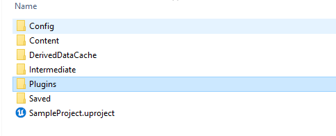

# Plugin for Unreal Engine

With this plugin, you can easily upload an IFC file in Unreal Engine.
It will automatically import the generated meshes.

## Installation and Usage

In order to install the plugin in your Unreal Engine Project, you need to follow the following steps:

1. Create an Unreal Engine Project   
 You can choose what template you want to have, e.g. first person view or third person view.
 Make sure that the `Starter Content` is ticked.

2. Go to the folder where you stored your project. Create a `Plugins` folder if it has not been created yet and copy the `IFC2UE` folder into the `Plugins` folder.

3. Start you Unreal Engine Project and you can already see the Plugin (Blue Box)!

4. Open the Plugin and select an IFC file you would like to convert. In the folder `Sample IFC Files` contains some files you
could use.

5. View the created folder in the content browser

6. If you want to have the possibility to go through doors and turn on and off the lights, you can create an actor. Right click
in any folder you would like the asset to be stored and click on `New Blueprint`. Select the `Building` actor as parent class.

7. Now you need to specify what meshes you want to place when spawning the building actor. For that, double-click on the created
actor and an editor window will pop up. Specify the path of the `Meshes` folder, e.g. Game/IFC2UE/YourBuilding/Meshes. Now you can drag
your actor into the world!

And Now you are done!

## Note
Please make sure that the backend is accessible via `http://localhost:8080/`