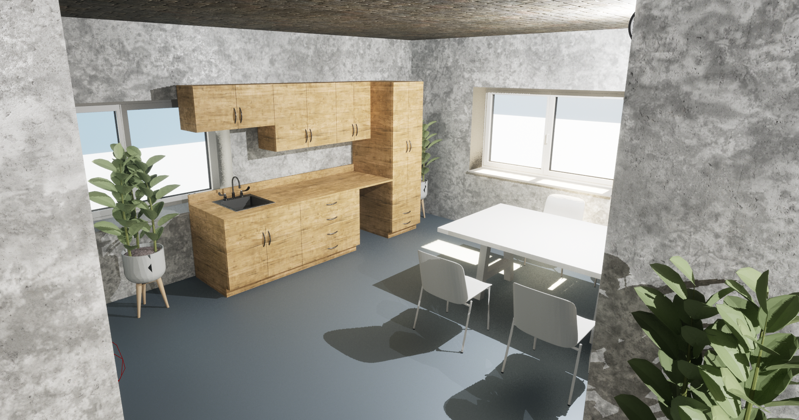
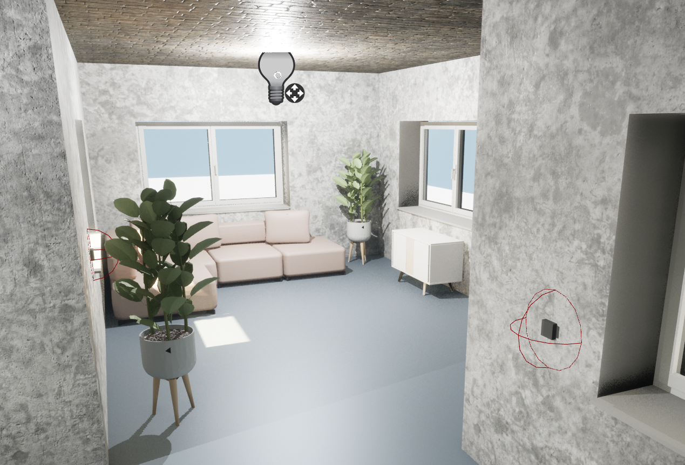

# 3D Representation of Buildings for Game Engines using Ontologies

Motivated by the QE Research group the goal of this thesis is to create a plugin for Unreal Engine, a 3D computer graphics game engine, which allows the user to upload an IFC file and convert it to an FBX, short for film box,  file. The plugin shall be able to add the materials specified in the BIM Tool to the objects and allow the user to switch on lights by switching the light switch. This shall improve the communication between stakeholders, especially those who are not operating in the civil engineering context, such as software engineers.

The visualization should help to get an easy overview of the building.
Furthermore, as it is created with ontologies, it is also possible to
enrich the building with information from other domains.

## Examples
In the folder /IFCFiles you can find some IFC files that can be used for testing
the application.
It is advised to use the IFC2x3 version for a realistic representation of the building.
Furthermore, the properties should also be exported in order to have realistic materials and the ability to turn on and off the lights.
- **Demo Building**:  The building contains basic furniture and two lights:
  one in the living room and another one in the kitchen.

The DemoBuilding.ifc, for examples contains lights and switches which can
be switched on and off in the building.

## Installation
The application consists of two parts: the plugin and the backend.

### Plugin
- In order to use this application, you first need to add the plugin to your
  Unreal Engine project.
- An installation instruction and "How to use" can be found  [here](Plugin/Readme.md).

### Backend
- An instruction on how to run the server can be found [here](OntologyToMeshConverter/Readme.md).